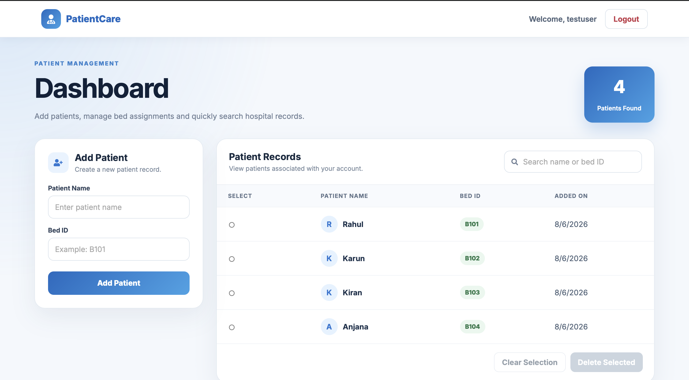
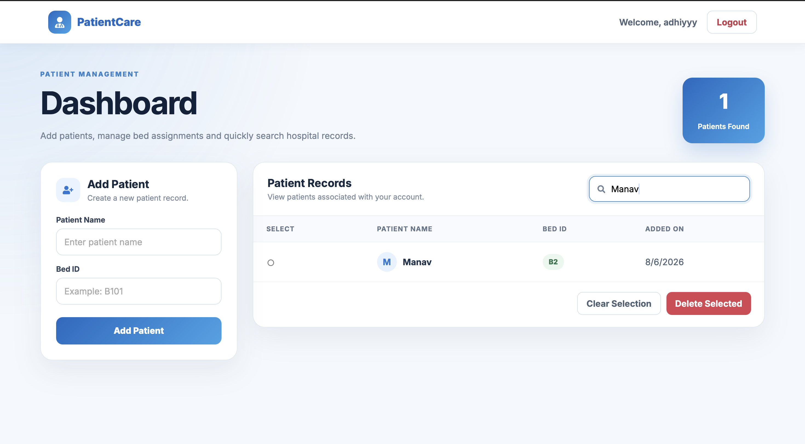

<div align="center">

# PatientCare

### Modern Full-Stack Patient Management System

A secure, responsive, and user-friendly patient management platform built with **React**, **Node.js**, **Express.js**, and **MongoDB Atlas**.

---

### Tech Stack


<br><br>

Secure Authentication • Patient Management • Search • Protected Routes • Responsive UI

</div>

---

# About the Project

Healthcare organizations require a secure and efficient way to manage patient information. **PatientCare** was developed to provide a simple yet modern solution for managing patient records through a clean and intuitive web interface.

The application enables authenticated users to securely register, log in, create patient records, search patients by name or bed ID, and delete patient records with confirmation dialogs. Access to patient records is protected using **JWT authentication**, ensuring users can access only the patient records associated with their own account.

This project demonstrates the implementation of a complete **MERN-style full-stack application**, focusing on authentication, REST APIs, database integration, and responsive frontend development.

---

# Live Demo

### PatientCare is deployed and available online

**Live Application:**  
https://patient-care-beta-livid.vercel.app

**Backend API:**  
https://patientcare-backend-ojcg.onrender.com

> **Demo Note:** The backend is hosted on Render's free tier. If the service has been inactive, the first request may take a short time while the server starts.

---

# Application Screenshots

<table>
<tr>
<td align="center">

### Login Page


</td>

<td align="center">

### Register Page


</td>
</tr>

<tr>
<td align="center">

### Dashboard



</td>

<td align="center">

### Patient Search



</td>
</tr>
</table>

---

# Key Features

### Secure Authentication

- User Registration & Login
- Passwords securely hashed using **bcrypt**
- JWT-based authentication
- Protected backend API routes

---

### Patient Management

- Add new patients
- View all patient records
- Delete selected patients safely
- Confirmation modal before deletion

---

### Smart Search

Quickly search patient records using:

- Patient Name
- Bed ID

Results are filtered instantly, making it easy to locate patient information.

---

### Modern User Interface

- Responsive design
- Professional Login & Register pages
- Clean and intuitive dashboard
- Inline form validation
- Show / Hide Password
- Custom Logout Confirmation
- Custom Delete Confirmation

---

# Technology Stack

## Frontend

- React.js
- Vite
- React Router DOM
- Axios
- React Icons
- CSS3

---

## Backend

- Node.js
- Express.js

---

## Database

- MongoDB Atlas
- Mongoose

---

## Authentication & Security

- JSON Web Token (JWT)
- bcryptjs

---

# System Architecture

```text
              User
                │
                ▼
      React Frontend (Vite)
                │
           Axios API Calls
                │
                ▼
       Express.js REST API
                │
        JWT Auth Middleware
                │
                ▼
            Mongoose
                │
                ▼
         MongoDB Atlas
```

---

# Installation

### 1. Clone the Repository

```bash
git clone https://github.com/adithyanv340/PatientCare.git
cd PatientCare
```

### 2. Backend Setup

Navigate to the backend directory and install the dependencies:

```bash
cd backend
npm install
```

Create a `.env` file inside the `backend` directory and add the following environment variables:

```env
PORT=5001
MONGO_URI=your_mongodb_connection_string
JWT_SECRET=your_jwt_secret
```

Start the backend development server:

```bash
npm run dev
```

The backend will run locally at:

```text
http://localhost:5001
```

### 3. Frontend Setup

Open a new terminal, navigate to the frontend directory, and install the dependencies:

```bash
cd frontend
npm install
```

Start the frontend development server:

```bash
npm run dev
```

The frontend will run locally at:

```text
http://localhost:5173
```

> **Note:** The deployed frontend is configured to communicate with the deployed backend API. To use the local backend during development, update the API base URL in `frontend/src/services/api.js` to `http://localhost:5001/api`.
---

## Author

**Adithyan V**

B.Tech in Artificial Intelligence & Data Science  
Muthoot Institute of Technology & Science

**GitHub**  
https://github.com/adithyanv340

**LinkedIn**  
https://www.linkedin.com/in/adithyanv340/

---
